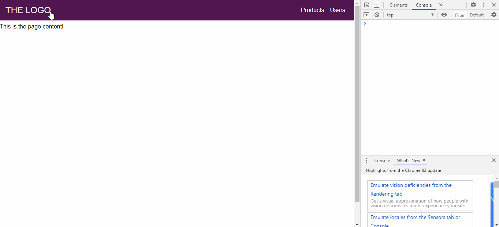
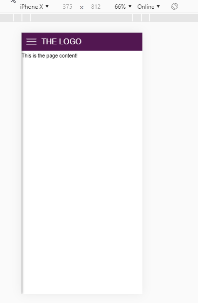

# React Responsive nav-bar
É uma barra de ferramenta (toolbar) responsiva que quando fica mobile,
aparece o menu "burguer" com as opções.




## Intalação

```sh
$ git clone https://github.com/ldonizete/react-responsive-navbar.git
$ cd react-responsive-navbar
$ yarn install
$ yarn start
```

## Licença

[MIT](http://opensource.org/licenses/MIT)

Copyright (c) Lucas Donizete 2020